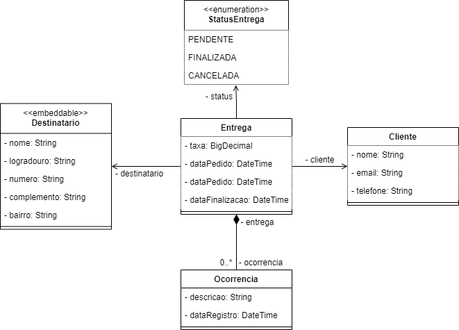

# AlgaLog API

  

O projeto AlgaLog-API é uma api de logistica criado durante o evento Mergulho Spring Rest promovido pela AlgaWorks.

---

### 📋 Pré-requisitos

* Java 11 ou superior
* Maven
* IDE favorita

---

### 🚀 Tecnologias e Ferramentas

Esse projeto foi desenvolvido com as seguintes tecnologias e ferramentas:

- Java
- Spring Boot
- Jakarta Persistence (JPA)
- Lombok
- Hibernate
- Maven
- ModelMapper
- Flyway
- Swagger
- Heroku
- PostgreSQL
- Postman
- IntelliJ IDEA
- Git

---

### 🎲 Modelo Conceitual

  

---
### 💻 Requisições

[Postman Collection](./.github/AlgaLog.postman_collection.json)

> A extensão [JSON Viewer](https://chrome.google.com/webstore/detail/json-viewer/gbmdgpbipfallnflgajpaliibnhdgobh/related?hl=pt-BR) proporciona uma experiência mais agradável para visualizar os dados

---

Feito por Ana Beatriz com ensinamentos da escola AlgaWorks!